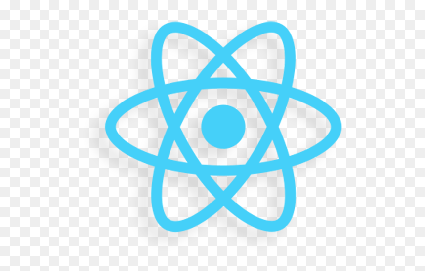

Quiz!

1. What is a React component?
A react component is a function that returns React Elements. UI. Components resued again & again.

2. What's wrong with this code?
```
function MyComponent() {
    return (
        <small>I'm tiny text!</small>
    )
}
``
Component name should be Pascal case.

3. What's wrong with this code?
```
function Header() {
    return (
        <header>
            <nav>
                
            </nav>
        </header>
    )
}

ReactDOM.render(<Header />, document.getElementById("root"))
```